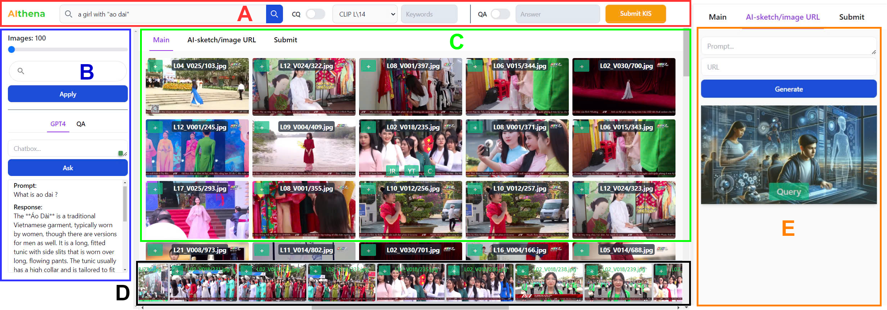
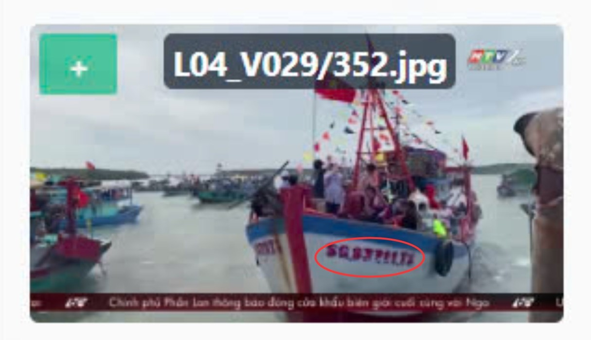
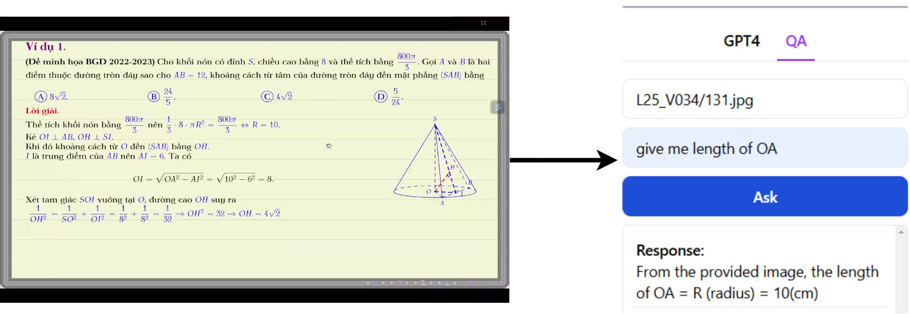
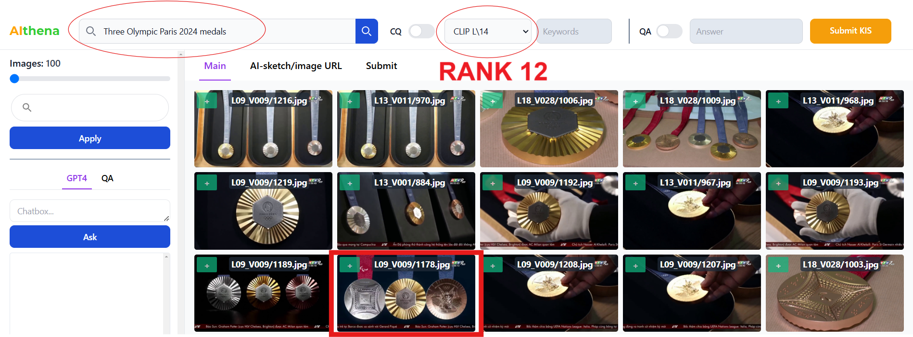
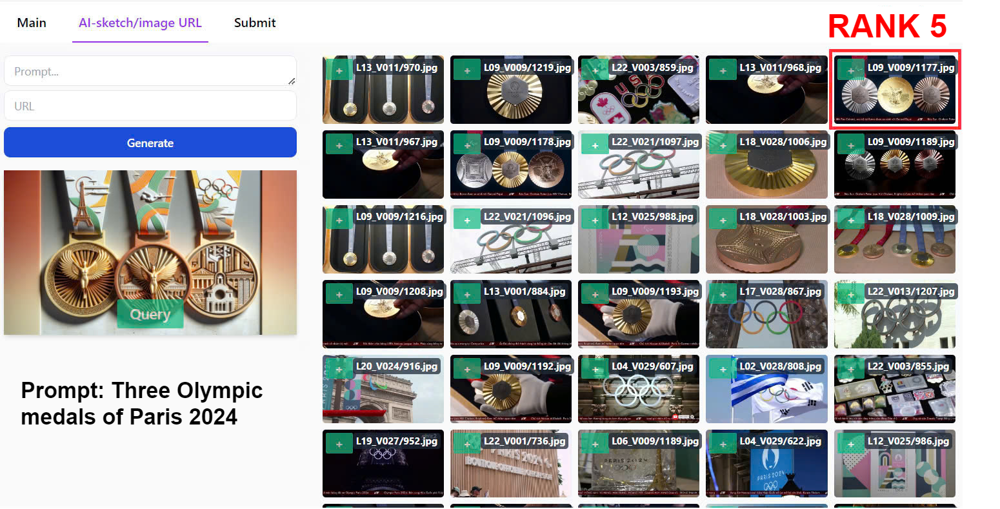

# AIthena Team
## Some system images

### Full graphical user interface and simple query test

### OCR-based query

### Question and Anwser using GPT-4o API

### Rank comparison of CLIP-based and Gen-AI image-based query



## Setup
#### Warning: This system work perfectly on python==3.11.9 and pip==24.0
#### Please follow the instruction below

```
pip install git+https://github.com/openai/CLIP.git
```
```
pip install -r requirements.txt
```

### Backend folder
- First, we have to start our backend
- Check the CLIP-features folder first, please copy all features file into this folder 
- cd backend and run **_genarateIndexBinFile.py_**
- Creat **.env** file that contains **OPENAI_API_KEY** and **SESSION_ID**
- To host the backend:

```
python app.py
```

### Frontend folder
- Copy your images into **_Frontend/public/images_** 

```
npm install
```
```
npm run dev
```
